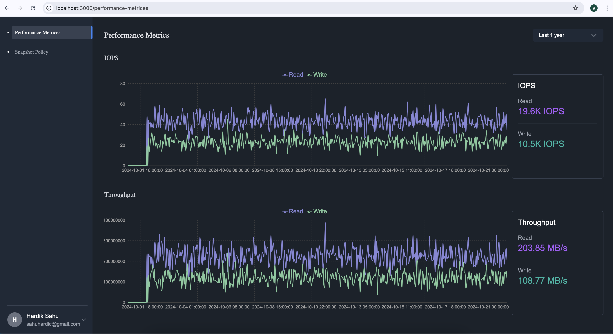
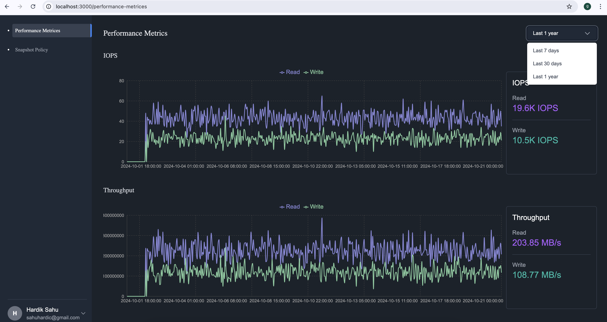
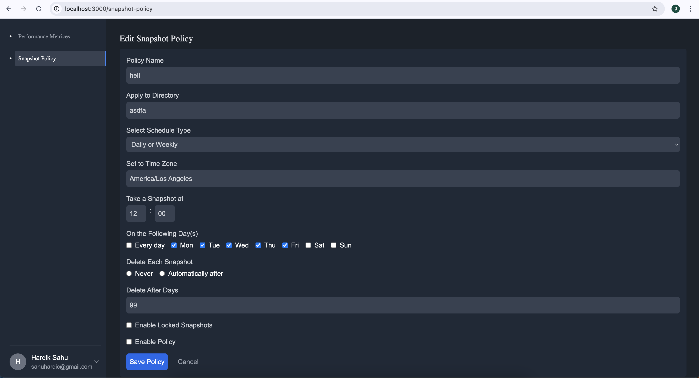

# Cluster Dashboard & API

## Overview

This project consists of a backend built with AdonisJS and a frontend built with Next.js. It provides users with metrics such as IOPS and Throughput for clusters. The backend communicates with a SQLite database for storing data locally, while the frontend visualizes the metrics using charts and forms for setting snapshot policies.

## Backend

### Technologies Used
- **AdonisJS**: Backend framework.
- **SQLite**: For storing data locally.
- **Jest**: For writing test cases, following Test-Driven Development (TDD) in services.
- **@vinejs/vine**: For request validation.
- **Faker.js**: For generating dummy data for database seeding.

### Installation Steps

1. **Clone Repository**: Clone this repository to your local machine.
    ```sh
    git clone <repository-url>
    ```
2. **Install Dependencies**: Navigate to the backend directory and install dependencies.
    ```bash
    cd cluster-api
    npm install
    ```
3. **Create Environment File**: Create a `.env` file based on the `.env.example` provided in the repository.
4. **Run DB Migrations**: Run database migrations using:
    ```bash
    node ace migration:run
    ```
5. **Seed Database**: Seed the database for development:
    ```bash
    node ace db:seed
    ```
6. **Run Server**: Start the backend server in development mode:
    ```bash
    npm run dev
    ```

### Key Features & Points

1. **Dynamic Performance Metrics APIs**: 
   - Performance metrics APIs are dynamic, allowing users to fetch data based on a date range, with groupings available in 30 seconds, 1 minute, 5 minutes, 15 minutes, 30 minutes, 1 hour, 8 hours, 1 day, 15 days, 1 week, and 1 month intervals.

2. **Security Considerations**:
   - **Input Security**: Ensuring input security via CSRF Protection, Input Validation, and Sanitization.
   - **Security Headers**: Implementing security headers like Content-Security-Policy, X-Frame-Options, Strict-Transport-Security, and X-Content-Type-Options.
   - **Encryption & Rate Limiting**: Utilizing HTTPS enforcement, rate limiting, and encryption.

3. **Performance Optimizations**:
   - **Note**: Performance optimizations, including DB-level processing for time slots, are detailed in the `PerformanceMetricsService`.

### Notes
- Throughout the codebase, important points have been marked using `// Note:` comments.

## Frontend

### Technologies Used
- **Next.js**: Frontend framework.
- **React Query**: Simplifies state management by handling caching, synchronization, and background updates for server-side data, improving performance and reducing boilerplate code.
- **Axios**: For making HTTP requests with automatic JSON transformation, request/response interception, and easy error handling.
- **Formik**: Simplifies form management by handling form state, validation, and submission.
- **Tailwind CSS**: CSS utility framework for designing.
- **Yup**: Schema validation for form inputs.
- **Recharts**: Data visualization library used to create interactive charts.

### Installation Steps

1. **Navigate to Frontend Directory**: Move to the frontend directory.
    ```sh
    cd cluster-dashboard
    ```
2. **Install Dependencies**: Install frontend dependencies.
    ```sh
    npm install
    ```
3. **Create Environment File**: Create a `.env.local` file based on the `.env.example` provided in the repository.
4. **Run Development Server**: Start the frontend server.
    ```sh
    npm run dev
    ```

## Screenshots

### Performance Metrics Page



### Snapshot Policy Page


## Important Points

- **Dynamic API**: The performance metrics API is dynamic, allowing the user to specify a time range and the grouping interval (e.g., 1 hour, 8 hours, 1 week, etc.).
- **Security Best Practices**: To ensure security, the backend incorporates CSRF protection, input validation, encryption, and secure headers. More details on security measures are available within the codebase, marked by comments.
- **Codebase Notes**: Important information, suggestions, and optimizations are highlighted throughout the codebase using comments that start with `// Note:`.

## Security Considerations

1. **CSRF Protection**
2. **Input Validation & Sanitization**
3. **CORS Configuration**
4. **Encryption and Hashing**
5. **HTTPS Enforcement**
6. **Rate Limiting**
7. **Security Headers**: Content-Security-Policy, X-Frame-Options, Strict-Transport-Security, and X-Content-Type-Options

## Running Tests

- **Jest**: Test cases have been written to ensure that the services work as expected. We followed TDD for the services layer.
- Run tests using:
  ```bash
  npm test
